# **_Nero's Pizza_**

Nero's Pizza is a small recently opened (fictional) pizzeria based in Oranmore, Galway, Ireland. The site is for a new business and is targeted at people around the area (and beyond) to get to know the business more.

The site was designed using the mobile first development model with additional media queries for devices with larger screens.

<i>Why Mobile First?</i> Over half of website traffic comes from mobile devices and over 90% of internet users access the internet using a mobile phone. <a href="https://explodingtopics.com/blog/mobile-internet-traffic" target="_blank" rel="noopener">Source</a>

View the Live Website - <a href="https://carlow78.github.io/nerospizza/index.html" target="_blank" rel="noopener">Nero's Pizza</a>

# Am I responsive images:

The below screenshot shows what the site looks like in various screensizes.

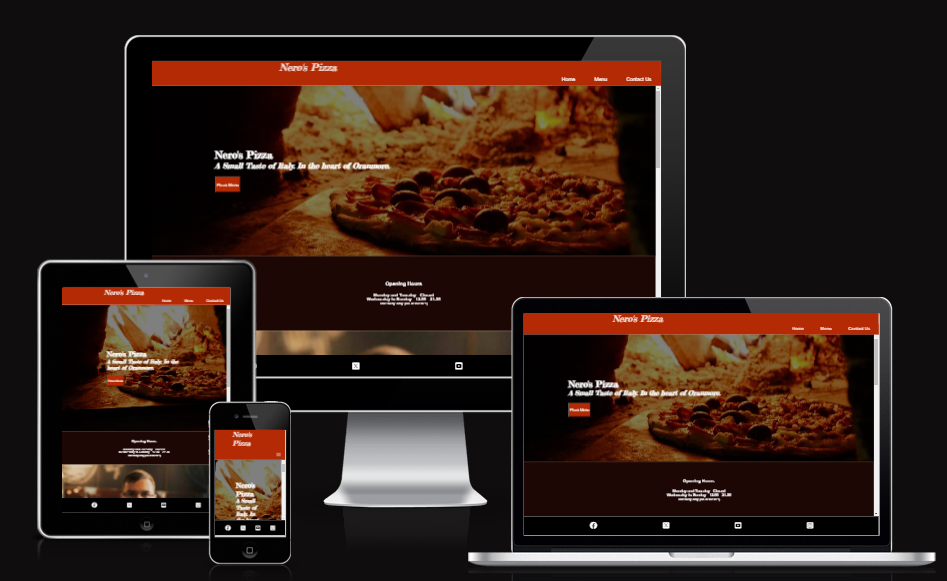

# Contents

* [**User Experience UX**](<#user-experience-ux>)
    *  [User Stories](<#user-stories>)
    * [Wireframes](<#wireframes>)
    * [Site Structure](<#site-structure>)
    * [Design Choices](<#design-choices>)
    *  [Fonts](<#fonts>)
    *  [Color Scheme](<#color-scheme>)

* [**Main Features**](<#features>)

    [**Header Section**](<#header-section>)
        
  * [Navigation Menu](<#navigation-menu>)
  * [Restaurant Name](<#restaurant-name>)
  
* [**Footer Section**](<#footer>)

* [**Menu Page**](<#menu-page>)

* [**Contact Us Page**](<#contactus-page>)

 [**Future Features**](<#future-features>)
* [**Technologies Used**](<#technologies-used>)
* [**Testing**](<#testing>)
* [**Deployment**](<#deployment>)
* [**Credits**](<#credits>)
    * [**Content**](<#content>)
    * [**Media**](<#media>)
*  [**Acknowledgements**](<#acknowledgements>)

# User Experience (UX)

## User Stories

As a user I want to ...

* find out the opening times of the pizzeria.
* contact Nero's Pizza for more information.
* see what pizzas are available, the price and ingredients.
* see if any pizza contains any allergens
* possibly connect with Nero's Pizza on social media.

[Back to top](<#contents>)

## Wireframes

The wireframes for Nero's Pizza were produced in [Balsamiq](https://balsamiq.com). As I started developing the website and looking for inspiration. The final website does differ but the idea remains the same.

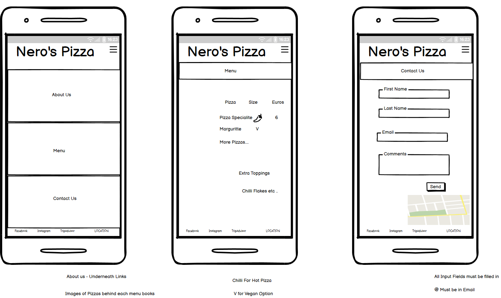 

[Back to top](<#contents>)

## Site Structure

Nero's Pizza website has three pages. The [home page](index.html) is the default loading page, the [menu](menu.html), and the [contact us](contact-us.html). All pages are accessible from the navigation menu and for mobile using the hamburger style menu.

[Back to top](<#contents>)

## Design Choices

* ### Fonts

The fonts chosen were 'Fredericka The Great' for the Pizzeria's Name and slogan and  'Poppins' for the body text. They fall back to sans-serif if neither font is available on the viewing device. 

  *  'Fredericka The Great' was chosen for the headings. After seeing it on a past Code Institute project and liking it. 

   * 'Poppins' is used for the body text as it is a clear font and easy to read (I tried several other fonts but found it easiest to read).

 * ### Color Scheme

I played around with different colors on the website but because I am a complete novice I decided to let AI help me to decide. So, I to upload the first image users will see when the visit site to Canva's - online color palette generator. (https://www.canva.com/colors/color-palette-generator/). I liked two of the four (milano red and creole) color suggestions and thought they would suit my website. Both colors would also suit the remaining photos as they are of similar contrast and styling.

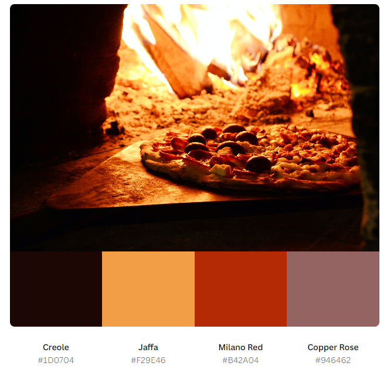

[Back to top](<#contents>)

# Main Features

### Header Section

The website site contains many features that the regular internet user would probably be familiar with, such as a header section with logo/site name, a hamburger menu (mobile)/navigation bar (for larger screens), and a footer containing social media outlets for the business.

  ### Navigation Menu

  The site contains a hamburger menu  (for mobiles) and navigation links  for larger screens (above 600px) 
    
  The hamburger/navigation menu are located at the top of all the pages in the site (within the header section), both are fully responsive and contain links to all the pages of the site to enable ease of navigation.

### Restaurant Name

  The restaurant name  is clickable with a link back to the home page. It is a constant across all three webpages.

 ### Footer
    
   Contains social media links to business social media outlets. All links are opened in new tabs.

    

[Back to top](<#contents>)

# Other features

### Home (index.html)

 ### Opening Hours

This section displays the opening hours of the pizzeria.

### About Us

The About Us section lets the users know a little about Nero's Pizza and it contains a <u>contact us</u> link to reach out to the site owners.

### Location/Telephone

Displays the Google Map image of the pizzerias location, and their telephone number.
      
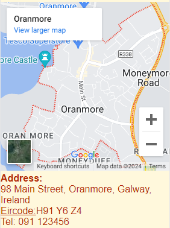

!
[Back to top](<#contents>)

## Menu Page

This page primarily contains the pizzas available at the pizzeria. Each pizza listed contains its current price and ingredients.

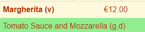

Each pizza contains allergen warnings. These are highlighted in brackets in the ingredients.

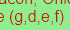

The Allergen keys is displayed at the bottom of the menu. 

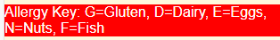

Finally, the pepper icon (thanks to font awesome) is shown on any pizza name that contains spicy ingredient(s).

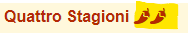

[Back to top](<#contents>)

## Contact Us Page

  This webpage is contains 4 fields

  1. First name
  2. Second name
  3. Email address
  4. Comments

  All 4 fields must be filled or else the user will receive an alert message, when they try to submit their query.

  For the first name/second name and comments fields the following alert message is shown

  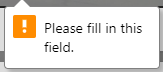

And for the email field:

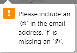

[Back to top](<#contents>)

## Future Features 

* A webpage for suppliers of the local ingredients.
* A ordering page for users to purchase the pizzas online.
* More information about the owners of the pizzeria. 
* Online reviews of the pizzeria.

[Back to top](<#contents>)

# Technologies Used
* [HTML5](https://html.spec.whatwg.org/) - provides the content and structure for the website.
* [CSS](https://www.w3.org/Style/CSS/Overview.en.html) - provides the styling.
* [Balsamiq](https://balsamiq.com/wireframes/) - used to create the wireframes.
* [Visual Studio](https://code.visualstudio.com/) - was used to code locally after being recommended by a fellow student on the course. I started initially using Codeanywhere but due to its slowness and some issues when I was following and coding along with the Code Institute's excellent Love Running walkthrough project. I decided to look for an alternative.
* [Github](https://github.com/) - was used to store the project's webpages and images. After every session I pushed the updates to github for further validation and testing. 

[Back to top](<#contents>)

# Testing

Please refer to [**_here_**](TESTING.md) for more information on testing Nero's Pizza.

[Back to top](<#contents>)

# Deployment

### **To deploy the project**

The site was deployed to GitHub pages. The steps to deploy a site are as follows:

Note: Early deployment ensures bugs or issues are discovered at the earliest possible stage in the live environment. 

  1. In the GitHub repository, navigate to the **Settings** tab.
  2. Once in Settings, navigate to the **Pages** tab on the left hand side.
  3. Under **Source**, select 'Deploy from a branch'
  4. Under **Default Branch** make sure 'main' is selected as the 'branch'  and '/root' as the folder.
  5. Finally, click the **Save** button under the **Branch** section
  6. Depending on the size of the content the deployed website will finally appear at the top of Github with a link to Visit site.
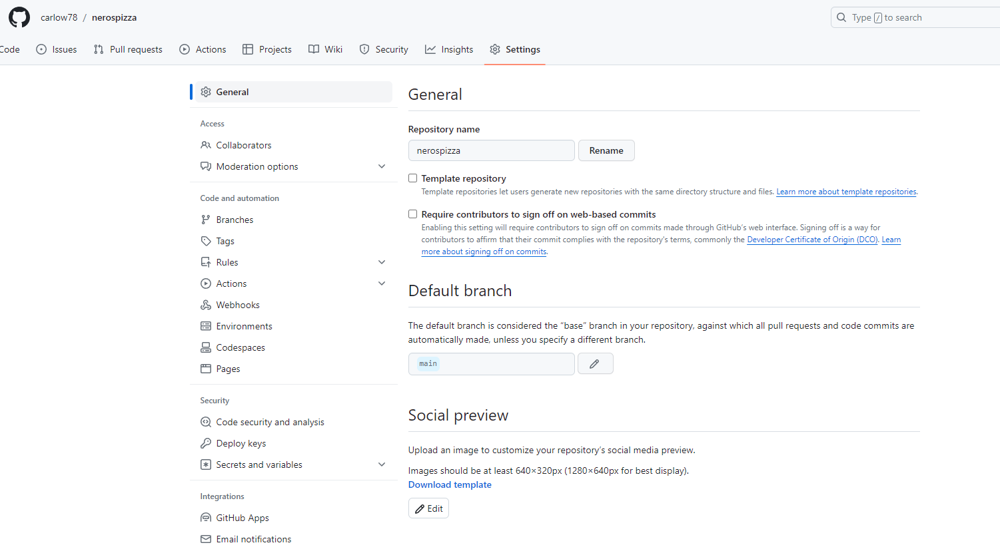

  The live link to the Github repository can be found here - https://github.com/carlow78/nerospizza

### **To fork the repository on GitHub**

A Fork is a new repository for sharing and collaborating with others without impacting the original.

1. Log in to **GitHub** and locate the repository you wish to Fork.

2. On the right hand side of the page inline with the repository name is a button called **'Fork'**, click on the **Create Fork** button to create a copy of the original repository in your GitHub Account.

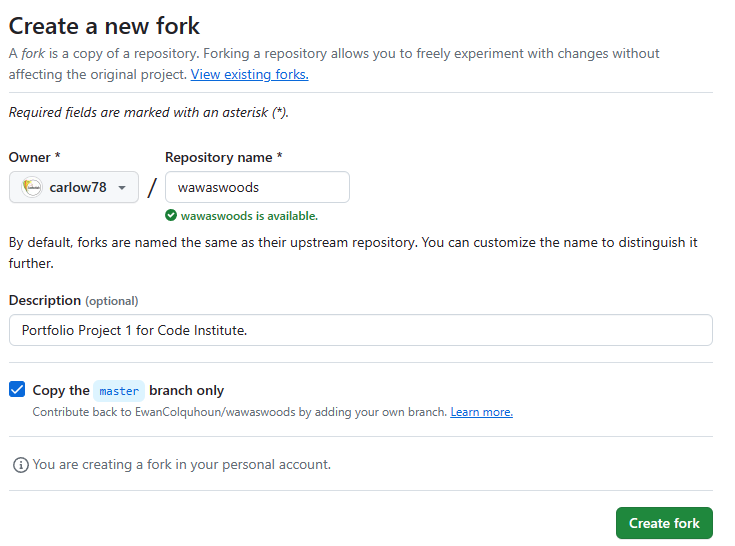

### **To create a local clone of this project**
The method from cloning a project from GitHub is below:

1. Under the repository’s name, click on the **code** tab.
2. In the **HTTPS** section, click on the clipboard icon to copy the given URL.

3. Click on **Open with GitHub Desktop** link
4. A warning message 'This is site is trying to open GitHubDesktop' is displayed. 
5. Click **Open** button
5. Take note of the 'local path' for future reference
6. Click on **Clone** button

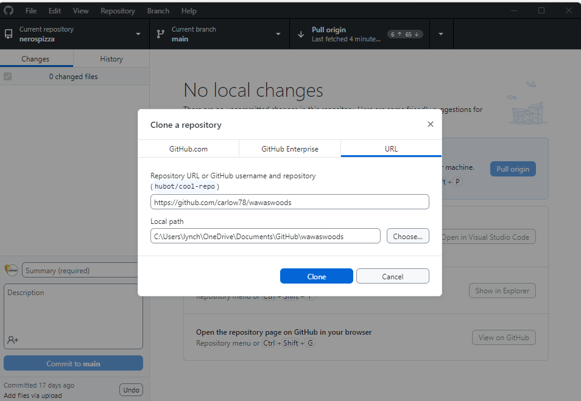

[Back to top](<#contents>)

# Credits

### Content

* The fonts came from [Google Fonts](https://fonts.google.com/).
* The map is embedded from [Google Maps](https://www.google.com/maps).
* The color palette was produced with the help of [Canvas Color Palette Generator](https://www.canva.com/colors/color-palette-generator/).
* The icons came from [Font Awesome](https://fontawesome.com/).
* The mobile hamburger menu was created with the help of this [YouTube tutorial](https://www.youtube.com/watch?v=fNcJuPIZ2WE).
* The [hero image](https://www.w3schools.com/howto/howto_css_hero_image.asp), [responsive menu](https://www.w3schools.com/howto/howto_css_table_responsive.asp) and [responsive contact forms](https://www.w3schools.com/howto/howto_css_responsive_form.asp) were created with the help of w3 schools online tutorials.
* [Balsamiq](https://balsamiq.com/wireframes/) was used to create the wireframes.
* The pizza menu inspired by [Dinn Ri Carlow Pizza Menu](https://www.dinnri.com/index.php/pizza-menu/)
* Pizzeria content and about us inspiration courtesy of [The Dough Bros](https://www.thedoughbros.ie/). 
* Footer created with the help of Code Institutes excellent Love Running Walkthrough Project. 

### Media

* The photos all came from [Pexel](https://www.pexels.com/)
* The photos were compressed using Windows Photos Application
* Conversion of photos using [Convertio](https://convertio.co/) from .jpg to .webp

[Back to top](<#contents>)

# Acknowledgements

The site was completed as a Portfolio 1 Project piece for the Full Stack Software Developer (e-Commerce) Diploma at the [Code Institute](https://codeinstitute.net/). Thank you to my mentor Precious Ijege for his input and sharing projects similar to mine and [Ewan's](https://github.com/EwanColquhoun/wawaswoods) excellent documentations, the Slack community, the Stack Overflow community and all at the Code Institute for their help and support.

[Back to top](<#contents>)
