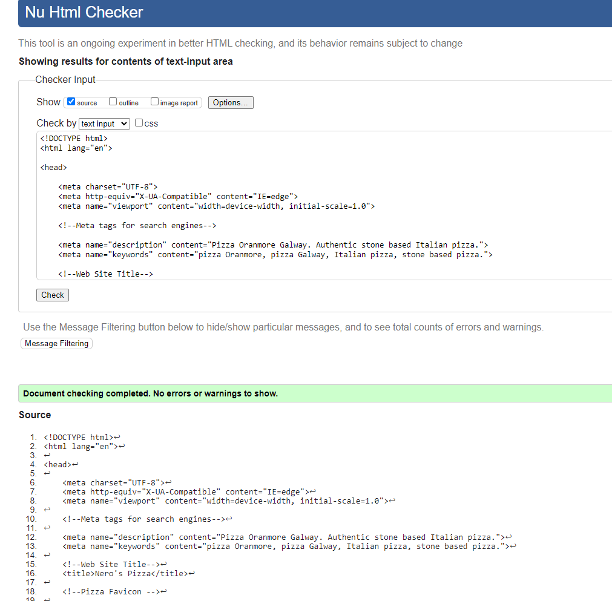
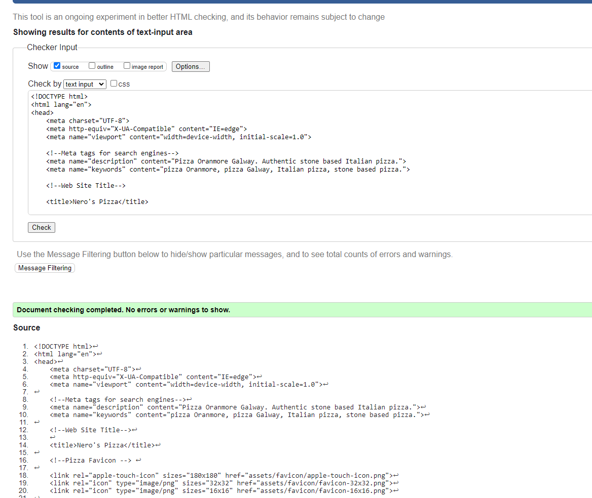
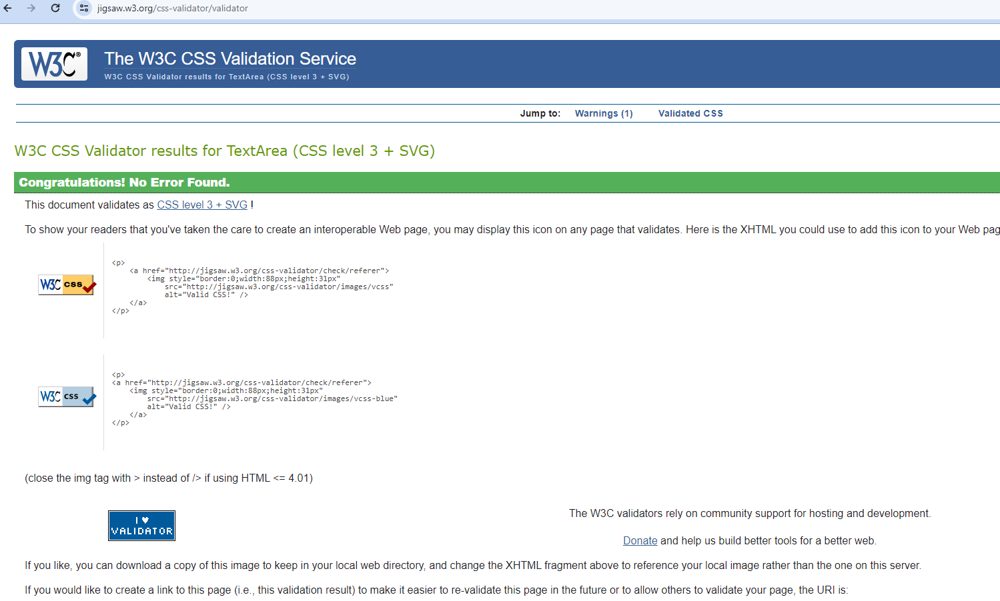
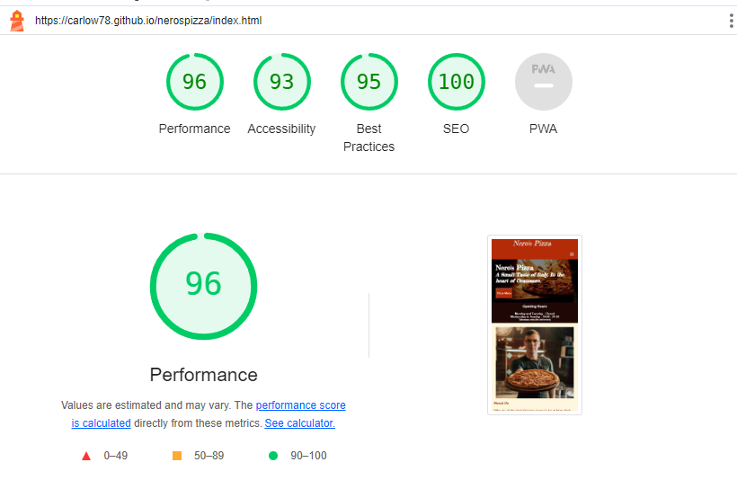
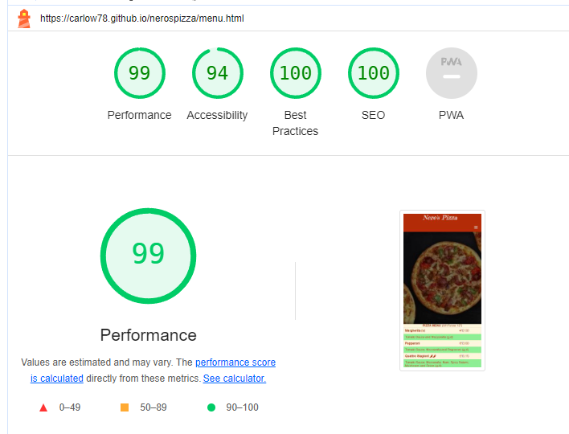
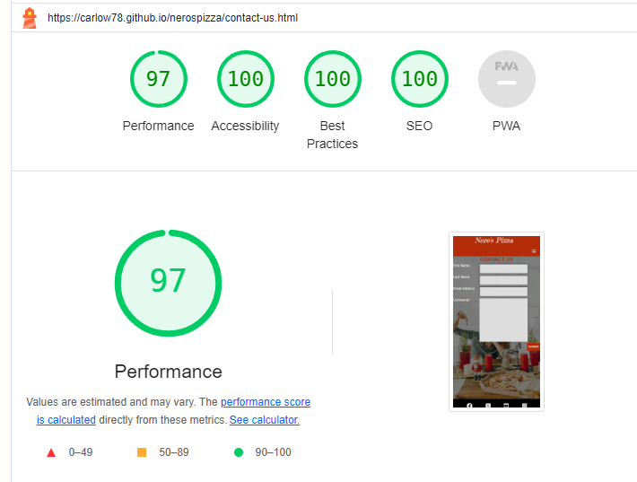

# Development

The website was developed using Mobile First development. Following the same method as Code Institutes Love Running Project. The website was designed using Chrome Developer Tools to work on the Samsung Galaxy Fold in Portrait mode. Media queries were then added for larger screens.

# Testing

## Code Validation
The Nero's Pizza site has be tested fully.

  All the code has been run through the [W3C html Validator](https://validator.w3.org/) and the [W3C CSS Validator](https://jigsaw.w3.org/css-validator/). Minor errors were found on the pages and in the CSS file. All errors were fixed some with the help with the Stack Overflow community.

The HTML validator results for each page are below:

* Home page

* Menu page

* Contact us page

The CSS validator results are below:

## Responsiveness Test

The responsive design tests were carried out manually with the [Google Chrome DevTools](https://developer.chrome.com/docs/devtools/).

Manual tests were also carried on the developer's own devices.

* OnePlus Nord 3 5G (2023)using Chrome - no issues
* iPad 10.5" (6th Generation) (2018) using Safari - no issues.
* Amazon Fire HD 8 (2020) using Amazon Silk - no issues.

# Chrome Developer Tools Test

|        | Samsung Galaxy Fold| iPad | iPad Pro| iPhone SE | iPad Mini | Display <1200px | Display >1200px |
|--------|---------|-----------|----------|------|----------|-----------------|-----------------|
| Render | pass    | pass      | pass     | pass | pass     | pass            | pass            |
| Images | pass    | pass      | pass     | pass | pass     | pass            | pass            |
| Links  | pass    | pass      | pass     | pass | pass     | pass            | pass            |

## Browser Compatibility

Nero's Pizza site was tested on the following browsers with no visible issues for the user. 

* Google Chrome
* Microsoft Edge
* Safari
* Amazon Silk
* Mozilla Firefox

 Appearance, functionality and responsiveness were consistent throughout for a range of device sizes and browsers.

## Bugs/Issues

* ### Resolved

*Home page*

No major issue except for trailing div and missing > which were left after I removed code previously

*Menu page*
    
My main was the following Error message - <i>a table row has 2 columns wide and exceeded the column count</i>.

 I copied the error message into Google and found someone else had experienced the same error message.

After I added colspan="2" to my pizza ingredients my issue was resolved - 

[Stackover Flow Colspan issue](https://stackoverflow.com/questions/7132223/a-table-row-was-2-columns-wide-and-exceeded-the-column-count-established-by-the)
    Resolved by User PeeHaa 

##Unresolved/Minor Bug##

Contact Us

My main issue with Contact Us was the lack of content which resulted in blank spaces (my cornsilk background underneath my contact us image) on larger  screen. This issue was mainly resolved by adding media queries with padding-bottom: % but not totally. 

I did resolve the issue when I added more content by moving the location container from the index page but I wasnt happy with the change.

## Additional Testing

### Lighthouse

The site was also tested using [Google Lighthouse](https://developers.google.com/web/tools/lighthouse) in Chrome Developer Tools to test each of the pages for:

* Performance - How the page performs whilst loading.
* Accessibility - Is the site acccessible for all users and how can it be improved.
* Best Practices - Site conforms to industry best practices.
* SEO - Search engine optimisation. Is the site optimised for search engine result rankings.

# Home (Index)

# Menu

# Contact Us

This part of the testing process showed that the site's performance was pretty slow ~60% (LCP - Largest Contentful Paint) was bringing the score down, primarily due to the image sizes.

# Fixing LCP issue

1. Using Windows Photo Editor all photos were reduced in size (1024x) and quality reduced but to a point the image wasnt too comprised. 
2. Afterwards the images were saved as .jpg. 
3. Next step, was to save jpg as webp using [convertio](https://convertio.co/) an online file convertor tool. (webp allows websites to display high-quality images - but with much smaller file sizes jpeg, png etc - [Source - Adobe](https://www.adobe.com/ie/creativecloud/file-types/image/raster/webp-file.html) files). 
 4. All the images needed to be removed before adding the reduced photos to the repository in their place
 Outcome - Once this was done the performance went from ~60% to ~90%. 
 

Back to [README.md](./README.md#testing).
